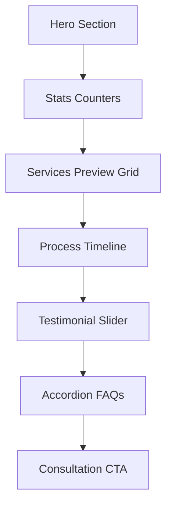

# Detailed Phase-Wise Architecture: Pravaah Legal

This document outlines the detailed architecture, structure, design patterns, and file layouts for the **Pravaah Legal** premium legal consulting website.

---

## 🛠️ Complete Directory Structure

```text
Pravaah-Legal/
├── public/
│   ├── favicon.svg
│   ├── robots.txt
│   ├── sitemap-index.xml
│   └── assets/
│       ├── images/
│       │   ├── og-cover.jpg
│       │   ├── hero-bg.jpg
│       │   └── team/
│       └── icons/
├── src/
│   ├── components/
│   │   ├── Navbar.astro
│   │   ├── Footer.astro
│   │   ├── Hero.astro
│   │   ├── ServicesPreview.astro
│   │   ├── Timeline.astro
│   │   ├── Testimonials.astro
│   │   ├── FAQ.astro
│   │   ├── CTA.astro
│   │   ├── ServiceCard.astro
│   │   ├── PricingCard.astro
│   │   └── ContactForm.astro
│   ├── layouts/
│   │   └── BaseLayout.astro
│   ├── pages/
│   │   ├── index.astro
│   │   ├── services.astro
│   │   ├── pricing.astro
│   │   ├── about.astro
│   │   └── contact.astro
│   ├── styles/
│   │   ├── _variables.scss
│   │   ├── _mixins.scss
│   │   ├── _resets.scss
│   │   ├── globals.scss
│   │   └── components/
│   │       ├── navbar.scss
│   │       ├── footer.scss
│   │       ├── hero.scss
│   │       ├── services.scss
│   │       ├── timeline.scss
│   │       ├── testimonials.scss
│   │       ├── faq.scss
│   │       └── contact.scss
│   ├── scripts/
│   │   ├── lenis-smooth.ts
│   │   ├── gsap-core.ts
│   │   └── validation.ts
│   └── data/
│       ├── services.json
│       ├── pricing.json
│       └── testimonials.json
├── astro.config.mjs
├── package.json
├── tsconfig.json
└── README.md
```

---

## 📅 Detailed Phase-Wise Implementation

---

### 🟢 Phase 1: Environment Setup & Tooling Configuration

#### 1. Dependency Analysis & `package.json`
* **Core Framework:** Astro v5.x is used to compile to clean, client-side javascript-free static HTML, injecting JavaScript only when hydrations or explicit scripting blocks demand it.
* **Styling Tools:** SASS (via `sass` compiler) is used for modular variable imports, nesting, mixins, and responsive layout breakpoints.
* **Physics & Motion:** `gsap` for timeline animations, and `lenis` to wrap the viewport container in a custom physics-driven smooth inertia scroll.
* **Asset Optimization:** Swiper.js for the testimonial carousel. Fonts are pre-fetched locally using `@fontsource` to eliminate Flash of Unstyled Text (FOUT).

#### 2. Alias Mapping Configuration (`tsconfig.json`)
Allows path shortcuts to avoid nested `../../` import directories:
* `@components/*` points to `src/components/*`
* `@layouts/*` points to `src/layouts/*`
* `@styles/*` points to `src/styles/*`
* `@scripts/*` points to `src/scripts/*`
* `@data/*` points to `src/data/*`

#### 3. Astro Compiler Rules (`astro.config.mjs`)
* Ensures HTML compression (`compressHTML: true`) is enabled for production builds.
* Uses the `@astrojs/sitemap` integration to automatically output a standard `sitemap-index.xml` upon compilation.
* Employs `scopedStyleStrategy: "where"` to avoid cascading weight overrides on dynamically styled elements.

---

### 🟡 Phase 2: Design System & Core Shell Layout

#### 1. Modular CSS Architecture
Instead of standard monolithic stylesheets, styling is split into structural imports:
* **`_variables.scss`:** Stores design variables:
  * Colors: Primary background (`#090909`), surfaces (`#141414`, `#1d1d1d`), brand gold (`#B08D57`, `#d3b27d`), support grey (`#8d8d8d`).
  * Layout: Border radii (`26px`), shadows, base ease transitions, maximum container width (`1280px`).
* **`_mixins.scss`:** Houses media query helpers (`tablet`, `mobile`, `desktop`) and flex/grid alignment shorthand generators.
* **`_resets.scss`:** Resets margins, padding, outline behaviors, and sets `box-sizing: border-box`.
* **`globals.scss`:** Aggregates partial SCSS files. Defines:
  * Font-families: `Playfair Display` for serif headings, `Inter` for sans-serif text.
  * Typography scaling: Employs CSS `clamp()` (e.g. `clamp(4rem, 8vw, 6.8rem)` for `h1`) to guarantee fluid text scaling without viewport breakpoints.
  * Global background decorators: Top-right and bottom-left radial gradient glowing background circles with high Gaussian blur filters.

#### 2. Page Shell Template (`BaseLayout.astro`)
Acts as the wrapper layout for all pages:
* Configures viewport scaling, standard meta headers, and document titles.
* Integrates Open Graph (`og:title`, `og:image`, `og:description`) and Twitter Card tags.
* Sets up web font preconnect configurations pointing to Google Fonts.
* Exposes a `<slot />` tag enabling children views to inject HTML bodies.

#### 3. Site Header & Footer
* **`Navbar.astro`:** Features a dynamic scrolling listener that transitions the background from fully transparent to a glassmorphic blurred dark row. Displays links from an array and incorporates an animated mobile drawer triggered via a hamburger button.
* **`Footer.astro`:** Automatically calculates the current year. Generates directory links, displays Jaipur corporate location indices, and displays a prominent CTA row pointing to booking page routes.

---

### 🔵 Phase 3: Homepage Implementation (Milestone 2)

Focuses on building the landing page sections:



#### 1. Hero Component (`Hero.astro` & `hero.scss`)
* Uses a dark grid pattern overlay masked with a radial gradient centered behind the content.
* Features a split-column design: text content and primary/outline buttons on the left; floating corporate legal preview cards with glassmorphic styles on the right.

#### 2. Stats Grid
* Formats facts into a responsive 3-column container (e.g., "500+ Engagements", "98% Satisfaction").
* Prepares numbers for count-up animations on scroll.

#### 3. Services Preview (`ServicesPreview.astro`)
* Generates a 3-column grid mapping service areas.
* Employs card designs with a top accent line that scales horizontally on hover, accompanied by slide-in arrow markers.

#### 4. Process Timeline (`Timeline.astro`)
* Features a chronological layout tracking phases (Consultation, Strategy, Execution, Resolution).
* Alternates content panels left and right along a central vector line on desktop viewports.

#### 5. Social Proof Carousel (`Testimonials.astro`)
* Houses client feedback slider rows using Swiper.js.
* Displays star rating markers and client credentials.

#### 6. FAQ Accordion (`FAQ.astro`)
* Uses semantic HTML `<details>` and `<summary>` tags to construct accessible, CSS-styled dropdown accordions.

#### 7. Conversion Section (`CTA.astro`)
* Displays an end-of-page booking CTA utilizing gold-gradient text layouts.

---

### 🟣 Phase 4: Inner Routing Pages & Data-Driven Schemas

#### 1. Separating Data from Templates
Content is separated into JSON files inside `src/data/` for easier updates:
* `services.json`: Detailed service arrays (Immigration subcategories, LPO task lists, Compliance categories).
* `pricing.json`: Pricing lists, comparison items, and consulting configurations.
* `testimonials.json`: Verified client testimonials list.

#### 2. Dedicated Page Views
* **Services Page (`src/pages/services.astro`):** Details specific consulting operations with dynamic tab panels and an overview of processes.
* **Pricing Page (`src/pages/pricing.astro`):** Implements card containers for packages alongside a features matrix comparison table.
* **About Page (`src/pages/about.astro`):** Outlines the firm's history, mission, values grid, and leadership profiles.
* **Contact Page (`src/pages/contact.astro`):** Integrates the `ContactForm` component, office location cards, and an interactive maps placeholder.

---

### 🟠 Phase 5: Physics-Based Animations (GSAP & Lenis)

Adds professional motion design to the website:

#### 1. Smooth Scrolling Layout (`lenis-smooth.ts`)
* Instantiates `Lenis` scrolling physics on user viewports.
* Integrates Lenis with GSAP's scroll handler:
  ```typescript
  lenis.on('scroll', ScrollTrigger.update);
  gsap.ticker.add((time) => {
    lenis.raf(time * 1000);
  });
  ```

#### 2. ScrollTrigger Actions (`gsap-core.ts`)
* Registers GSAP ScrollTrigger plugins.
* Selects elements containing reveal classes and triggers scroll reveals on scroll:
  * `.fade-up`: Moves upward from `y: 60` while transitioning opacity.
  * `.fade-left`/`.fade-right`: Side-revealing slide triggers.
  * `.scale-zoom`: Expands cards from `scale(0.95)` to `scale(1)`.
* Triggers statistical numbers counting animations from `0` to their final values when they enter the viewport.
* Binds an indicator bar to window scroll positions to show horizontal reading progress.

---

### 🔴 Phase 6: SEO, Accessibility, Auditing & Deployment

Prepares the site for production:

#### 1. Search Engine Optimization (SEO)
* **Metadata Schema:** Injects structured JSON-LD data into layouts to define the firm as a `LegalService` business:
  ```json
  {
    "@context": "https://schema.org",
    "@type": "LegalService",
    "name": "Pravaah Legal",
    "image": "https://pravaahlegal.com/images/og-cover.jpg",
    "url": "https://pravaahlegal.com",
    "telephone": "+91XXXXXXXXXX",
    "address": {
      "@type": "PostalAddress",
      "addressLocality": "Jaipur",
      "addressRegion": "Rajasthan",
      "addressCountry": "IN"
    }
  }
  ```
* **Asset Indexing:** Auto-generates a dynamic `sitemap-index.xml` file upon build. Configures `robots.txt` rules.

#### 2. Accessibility Compliance (WCAG 2.1 AA)
* Uses semantic landmarks (`<header>`, `<main>`, `<section>`, `<footer>`, `<nav>`).
* Adds focus ring states, `aria-expanded` attributes on toggles, and descriptive `aria-label` tags on icon buttons.

#### 3. Compilation & Deployment
* Uses `npm run build` to compile the codebase into optimized static assets.
* Configures continuous integration scripts to automate deployments to host destinations like GitHub Pages or Cloudflare.
